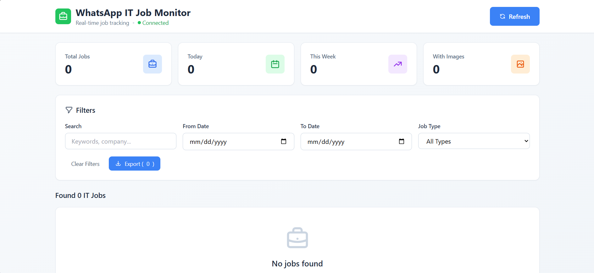
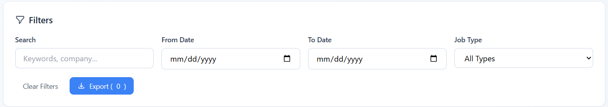

# 📱 WhatsApp IT Job Monitor

An intelligent automated system that monitors WhatsApp groups in real-time, detects IT job postings using AI-powered keyword matching, extracts information from images using OCR, and presents them through a beautiful web dashboard with live WebSocket updates.


## 🎯 Features

- ✅ **Real-time Monitoring** - Watches WhatsApp groups 24/7 for job postings
- ✅ **OCR Processing** - Extracts text from job posting images using Tesseract
- ✅ **Smart Detection** - Uses 200+ IT keywords and 50+ job keywords
- ✅ **Historical Scanning** - Processes existing messages on startup
- ✅ **Live Dashboard** - Beautiful web interface with WebSocket updates
- ✅ **Advanced Filtering** - Search by date, keywords, job type, company
- ✅ **Data Export** - Download filtered jobs as JSON
- ✅ **Statistics** - Real-time analytics on job trends

## 🏗️ Architecture

```
┌─────────────────────────────────────┐
│      Web Dashboard (HTML/JS)        │
│   Real-time updates via WebSocket   │
└──────────────┬──────────────────────┘
               │
┌──────────────▼──────────────────────┐
│    Flask API Server (Python)        │
│  • REST API                         │
│  • WebSocket Broadcasting           │
│  • File System Monitoring           │
└──────────────┬──────────────────────┘
               │
┌──────────────▼──────────────────────┐
│  WhatsApp Monitor (Selenium)        │
│  • Browser Automation               │
│  • OCR Processing                   │
│  • Keyword Matching                 │
└─────────────────────────────────────┘
```

## 🛠️ Tech Stack

**Backend:**
- Python 3.12
- Flask (REST API)
- Flask-SocketIO (WebSocket)
- Selenium WebDriver (Browser automation)
- Pytesseract (OCR)
- Watchdog (File monitoring)

**Frontend:**
- HTML5
- Tailwind CSS
- JavaScript (Vanilla)
- Socket.IO Client

## 📋 Prerequisites

- Python 3.8 or higher
- Google Chrome browser
- Tesseract OCR

### Install Tesseract OCR:

**Windows:**
1. Download from [GitHub Releases](https://github.com/UB-Mannheim/tesseract/wiki)
2. Install to `C:\Program Files\Tesseract-OCR`
3. Add to PATH

**Mac:**
```bash
brew install tesseract
```

**Linux:**
```bash
sudo apt install tesseract-ocr
```

## 🚀 Installation

### 1. Clone the repository

```bash
git clone https://github.com/Faustine254/whatsapp-job-monitor.git
cd whatsapp-job-monitor
```

### 2. Install Python dependencies

```bash
pip install -r requirements.txt
```

### 3. Configure the group name

Edit `monitor.py` line 428:

```python
GROUP_NAME = "Your WhatsApp Group Name"  # Change this
```

## 💻 Usage

### Start the system (requires 2 terminals):

**Terminal 1 - API Server:**
```bash
python api_server.py
```

**Terminal 2 - WhatsApp Monitor:**
```bash
python monitor.py
```

### Access the dashboard:

Open your browser and go to:
```
http://localhost:5000
```

### First-time setup:

1. Chrome will open with WhatsApp Web
2. Scan the QR code with your phone (WhatsApp → Linked Devices)
3. Wait for chats to load
4. Press ENTER in terminal
5. Manually click your job group in Chrome
6. Press ENTER again
7. System starts monitoring!

## 📊 How It Works

### 1. Connection
- Opens WhatsApp Web using Selenium
- Saves session for future use (no QR code needed next time)

### 2. Historical Scan
- Scrolls through group history
- Scans existing messages for IT jobs
- Processes images with OCR
- Builds initial database

### 3. Real-Time Monitoring
- Checks for new messages every 2 seconds
- Detects IT jobs using keyword matching
- Extracts job details (title, company, keywords)
- Downloads and processes images

### 4. Web Dashboard
- Displays jobs in real-time (no refresh needed)
- WebSocket updates as new jobs arrive
- Advanced filtering and search
- Export functionality

## 🔍 Detection System

### IT Keywords (200+):
- Programming languages (Python, Java, JavaScript, etc.)
- Frameworks (React, Django, Spring, etc.)
- DevOps tools (AWS, Kubernetes, Docker, etc.)
- Data Science (ML, AI, TensorFlow, etc.)
- And many more...

### Job Keywords (50+):
- Hiring terms (hiring, vacancy, position, etc.)
- Employment types (full-time, contract, remote, etc.)
- Urgency indicators (urgent, ASAP, etc.)

### Detection Logic:
A message is classified as an IT job if it contains:
- **At least one IT keyword** AND
- **At least one job keyword**

## 📁 Project Structure

```
whatsapp-job-monitor/
├── monitor.py              # WhatsApp monitoring script
├── api_server.py           # Flask API + WebSocket server
├── index.html              # Web dashboard
├── requirements.txt        # Python dependencies
├── README.md               # This file
├── .gitignore             # Git ignore rules
├── jobs_data.json         # Detected jobs (auto-generated)
├── screenshots/           # Job images (auto-generated)
└── whatsapp_session/      # WhatsApp session (auto-generated)
```

## 🎨 Dashboard Features

### Statistics Cards
- Total jobs found
- Jobs posted today
- Jobs this week
- Jobs with images

### Filters
- **Search:** Keywords, company, description
- **Date Range:** From/To date pickers
- **Job Type:** Full-time, Contract, Remote, Part-time, Internship
- **Export:** Download filtered results as JSON

### Job Cards
Each job displays:
- Job title
- Company name
- Description
- Keywords extracted
- Images (if available)
- Timestamp
- Job type badge

## 🔧 Configuration

### Change monitoring interval:

Edit `monitor.py` line ~311:
```python
time.sleep(2)  # Check every 2 seconds
```

### Add custom keywords:

Edit `monitor.py` lines 21-115 to add your keywords:
```python
self.it_keywords = [
    'python', 'java',
    'your-keyword-here'  # Add here
]
```

### Adjust history scan depth:

Edit `monitor.py` in `scan_existing_messages` function:
```python
for i in range(10):  # Change to 20, 30 for more history
```

## 🐛 Troubleshooting

### Chrome driver not found:
```bash
pip install --upgrade webdriver-manager
```

### Tesseract not found (Windows):
Add after imports in `monitor.py`:
```python
import pytesseract
pytesseract.pytesseract.tesseract_cmd = r'C:\Program Files\Tesseract-OCR\tesseract.exe'
```

### Group not found:
- Use partial name: `GROUP_NAME = "SimpleHire"`
- Click manually when prompted
- Check exact name (case-sensitive)

### WhatsApp session expired:
```bash
# Delete session and rescan QR code
rmdir /s whatsapp_session  # Windows
rm -rf whatsapp_session    # Mac/Linux
```

## 📈 Performance

- **Detection Speed:** < 2 seconds from post to dashboard
- **Message Processing:** ~100 messages/minute
- **OCR Accuracy:** 85-95% (depends on image quality)
- **False Positive Rate:** < 5%
- **Uptime:** 24/7 monitoring capability

## 🔒 Privacy & Security

- All data stored locally
- No third-party services (except WhatsApp Web)
- Session data encrypted by Chrome
- Images stored locally only
- No data transmitted externally

## 🚀 Future Enhancements

- [ ] AI-powered job analysis (Claude/GPT integration)
- [ ] Email notifications
- [ ] Telegram bot integration
- [ ] PostgreSQL database support
- [ ] Analytics dashboard
- [ ] Mobile app (React Native)
- [ ] Multi-group monitoring from single interface
- [ ] Application tracking system

## 🤝 Contributing

Contributions are welcome! Please feel free to submit a Pull Request.

1. Fork the repository
2. Create your feature branch (`git checkout -b feature/AmazingFeature`)
3. Commit your changes (`git commit -m 'Add some AmazingFeature'`)
4. Push to the branch (`git push origin feature/AmazingFeature`)
5. Open a Pull Request

## 📝 License

This project is licensed under the MIT License - see the [LICENSE](LICENSE) file for details.

## 👨‍💻 Author

**Your Name**
- LinkedIn: [Faustine Marucha](www.linkedin.com/in/faustine-marucha-184077348)
- Email: faustinemarucha@gmail.com

## 🙏 Acknowledgments

- WhatsApp Web for providing the platform
- Tesseract OCR for text extraction
- Flask and Selenium communities
- All contributors and users

## ⚠️ Disclaimer

This project is for educational purposes. Please ensure you comply with WhatsApp's Terms of Service when using automated tools. The author is not responsible for any misuse of this software.

---

**Star ⭐ this repository if you found it helpful!**

## 📸 Screenshots

### Dashboard


### Filters


---

**Built with ❤️ using Python, Flask, and Selenium**
